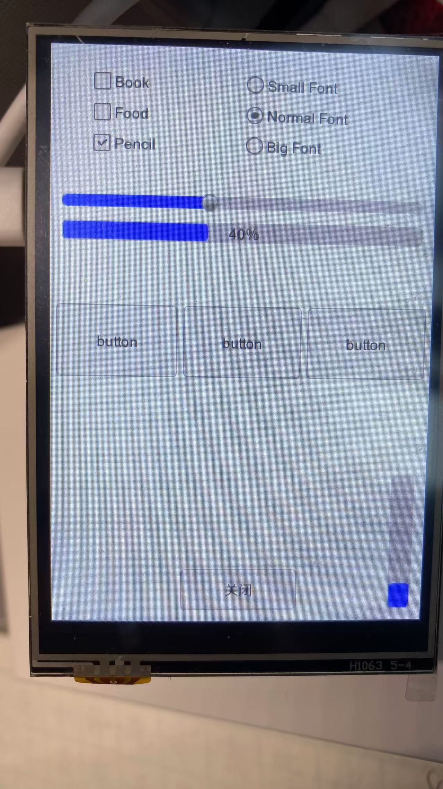

# 在树莓派 Pico 上运行 AWTK



## 0. 安装环境

* cmake

```sh
brew install cmake
```

* openocd

```sh
brew install openocd
```

* arm-none-eabi-gcc

> 用 brew 安装的版本会出现如下错误：

```sh
arm-none-eabi-gcc: fatal error: cannot read spec file 'nosys.specs': No such file or directory
```

> 用 arm 官方的版本没有问题。
```sh
cd ~/Downloads
wget https://developer.arm.com/-/media/Files/downloads/gnu/13.3.rel1/binrel/arm-gnu-toolchain-13.3.rel1-darwin-arm64-arm-none-eabi.tar.xz

cd /opt
sudo tar xf ~/Downloads/arm-gnu-toolchain-13.3.rel1-darwin-arm64-arm-none-eabi.tar.xz
```

* arm-none-eabi-gdb

```sh
brew install arm-none-eabi-gdb
```

* minicom

```sh
sudo apt install minicom
```

## 1. 下载源码

* 下载 awtk-pico

```sh
https://github.com/zlgopen/awtk-pico.git
```

* 进入 awtk-pico 目录
```
cd awtk-pico
```

* 下载 pico-sdk

```
git clone https://github.com/raspberrypi/pico-sdk.git 3rd/pico-sdk
```

* 下载 awtk

```
git clone https://github.com/zlgopen/awtk.git src/awtk
```

## 2. 编译

* 编译 awtk

```
cd src/awtk
scons
cd -
```

* 生成 demo 资源

```
cd src/demos/hello
python scripts/update_res.py all
cd -
```

* 编译 pico 固件

> 请编辑 build_rp2040.sh，修改 PICO\_TOOLCHAIN\_PATH 为实际路径。

```sh
./build_rp2040.sh
```

## 3. 烧录

* 方法 1

  按住按钮，插上电源。 会加载一个磁盘分区，把固件拷贝到该磁盘分区。完成后，会自动重启。

* 方法 2

> 使用 openocd 烧录。

```sh
./upload.sh ./build_rp2040/src/demos/app.elf
```

## 4. 调试

> 请确认连接了 pico debug probe。

* 启动 openocd

```sh
./start_debug.sh 
```

* 启动 gdb

```sh
./debug.sh 
```

## 5. 硬件说明

测试所用显示屏的尺寸为 3.5 寸，分辨率为 480x320，[微雪](https://www.waveshare.net/wiki/Pico-ResTouch-LCD-3.5) 出品，如果使用其它硬件， 代码需要做相应调整。

## 注意事项

* 为了将字体和图片等资源数据编译到代码中，需要修改示例项目的 project.json 文件：

```
 "const": "all_data",
```

参考：src/demos/hello/project.json

## 7. 参考资源

* https://www.raspberrypi.com/documentation/microcontrollers/debug-probe.html
* https://blog.csdn.net/absurd/article/details/144340608
* https://www.waveshare.net/wiki/Pico-ResTouch-LCD-3.5
  
