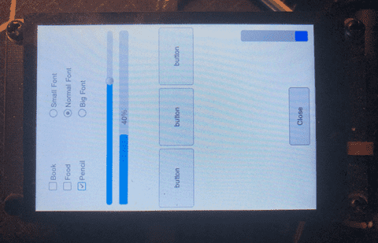

# 在 Pico_DM_QD3503728 上运行 AWTK



## 安装环境

安装 ARM 交叉编译工具链

```bash
cd ~/Downloads
wget https://armkeil.blob.core.windows.net/developer/Files/downloads/gnu/14.2.rel1/binrel/arm-gnu-toolchain-14.2.rel1-x86_64-arm-none-eabi.tar.xz

sudo tar xvf arm-gnu-toolchain-14.2.rel1-x86_64-arm-none-eabi.tar.xz -C /opt
sudo chown -R $(whoami) /opt/arm-gnu-toolchain-14.2.rel1-x86_64-arm-none-eabi
```

（可选）安装 RISC-V 交叉编译工具链

```bash
cd ~/Downloads
wget https://buildbot.embecosm.com/job/corev-gcc-ubuntu2204/47/artifact/corev-openhw-gcc-ubuntu2204-20240530.tar.gz

sudo mkdir -p /opt/riscv
sudo tar xvf corev-openhw-gcc-ubuntu2204-20240530.tar.gz -C /opt/riscv
sudo chown -R $(whoami) /opt/riscv/corev-openhw-gcc-ubuntu2204-20240530/
```

## 拉取源码

```bash
git clone https://github.com/embeddedboys/pico_dm_qd3503728_awtk.git
cd pico_dm_qd3503728_awtk
git submodule update --init
```

## 编译

### 编译 awtk

```bash
cd src/awtk
scons -j$(nproc)
cd -
```

### 生成 demo 资源

```bash
cd src/demos/hello
python scripts/update_res.py all
cd -
```

### 编译固件

编译 rp2040 固件

```bash
./build_rp2040.sh
```

编译 rp2350-arm 固件

```bash
./build_rp2350_arm.sh
```

编译 rp2350-riscv 固件

```bash
./build_rp2350_riscv.sh
```

## 烧录

以 Pico RP2040 为例

### picotool

```bash
sudo picotool -fuvx build/src/demos/pico_dm_qd3503728_awtk.uf2
```

### openocd

```bash
openocd -f interface/cmsis-dap.cfg -f target/rp2350-riscv.cfg -s tcl -c "adapter speed 10000" -c "program build/src/demos/pico_dm_qd3503728_awtk.elf verify reset exit"
```

（暂未实现）或者位于对应 build 目录下

```bash
ninja flash
```

## 注意事项

* 为了将字体和图片等资源数据编译到代码中，需要修改示例项目的 project.json 文件：

```
 "const": "all_data",
```

参考：src/demos/hello/project.json

## 7. 参考资源

* https://www.raspberrypi.com/documentation/microcontrollers/debug-probe.html
* https://blog.csdn.net/absurd/article/details/144340608
* https://www.waveshare.net/wiki/Pico-ResTouch-LCD-3.5
